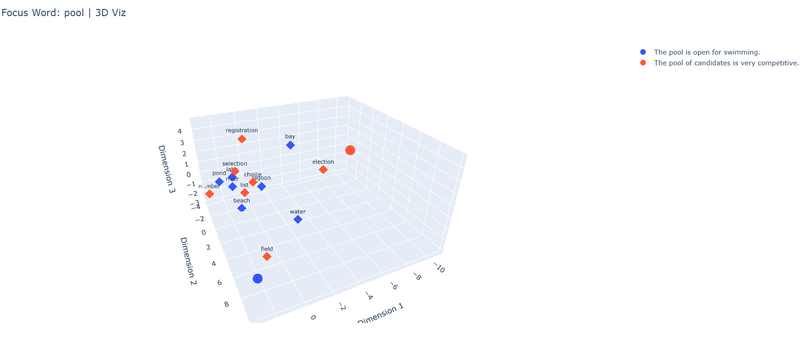

# ST-DC: Same Text, Different Context

Same Text, Different Context is a Python package for visualizing **contextual word embeddings** and their neighbors across different contexts. It helps you understand how the meaning of a word shifts depending on its surrounding text. This is achieved by leveraging **pretrained language models (like BERT)** to extract embeddings for focus words and their context-specific neighbors, and visualizing them in 2D or 3D.

---

## How It Works

Here's an quick explanation of how ST-DC works:

1. **Contextual Embedding Extraction**:
    - The package uses a pretrained language model (e.g., BERT) to generate contextual embeddings for a focus word (e.g., pool) in various sentences (contexts).
    - For example:
      - Sentence 1: "The pool is open for swimming."
      - Sentence 2: "The pool of candidates is very competitive."
    - In each sentence, the focus word's embedding represents its meaning in that specific context.

2. **Neighbor Prediction**:
   - The tool predicts words most semantically related to the focus word in each context using the model's [MASK] functionality.
   - For example:
      - In the sentence "The [MASK] is open for swimming," neighbors might include water, swim, and diving.
      - In the sentence "The [MASK] of candidates is very competitive," neighbors might include selection, group, and list.

3. **Dimensionality Reduction**:
   - Embeddings are originally high-dimensional (e.g., 768 dimensions for BERT).
   - To make visualization possible, these embeddings are reduced to 2D or 3D using techniques like:
      - PCA: Preserves as much variance as possible.
      - t-SNE: Captures local relationships between points.

4. **Visualization**:
   - Embeddings for the focus word and its neighbors are plotted in 2D or 3D space:
      - Focus Word Embeddings: Each context is represented as a unique point, color-coded for distinction.
      - Neighbor Words:Words semantically related to the focus word in each context are plotted near the corresponding focus word. This visualization helps you explore how the meaning of the focus word varies between contexts.

---

## Features

- **Extract embeddings**: Analyze how the meaning of a word changes in different contexts.
- **Visualize embeddings**: Explore embeddings in **2D or 3D** space using dimensionality reduction.
- **Neighbor words**: Display words closely related to the focus word for each context.

---

## Installation

To install ST-DC, run:

```bash
pip install st-dc
```

## Requirements

- Requires Python 3.11

## Usage

### Example 1: Visualizing Word "Pool"

```python
from context_explorer import viz
from samples import sentences_dict

# Define the focus word and its contexts
focus_word = "pool"
sentences = [
  "The pool is open for swimming.", 
  "The pool of candidates is very competitive."
  ]

# Visualize embeddings
viz(
    word=focus_word,
    sentences=sentences,
    dim_technique="pca",  # Dimensionality reduction technique (e.g., "pca", "tsne")
    num_neighbors=5,      # Number of neighbors to display
    plot_type="3D"        # Visualization type: "2D" or "3D"
)

```



The above image showcases the resulting visualizatiion. It features the following:

- An interactive 3D visualization
- Two distinct colors to represent the different contexts
- The embedding of the focus word (pool) in the different contexts
- The ```n``` closest words for the focus word in each context
- A legend to the side showing the color-context mapping

### Example 2: Switching to t-SNE and 2D Visualization

```python
focus_word = "king"
sentences = [
    "The king ruled the land wisely.",
    "The chess king was captured during the game.",
]

viz(
    word=focus_word,
    sentences=sentences,
    dim_technique="tsne",
    num_neighbors=5,
    plot_type="2D"
)

```

## FAQ

### 1. What pretrained models are supported?

Currently, the package uses bert-base-uncased as the default pretrained model. Support for additional models (like RoBERTa or DistilBERT) can be added by modifying the EmbeddingExtractor class.

### 2. Can I use my own sentences?

Yes, the sentences parameter in the viz function accepts any list of sentences.

## License

This project is licensed under the MIT License. See the LICENSE file for details.

## Acknowledgments

- This package leverages the Hugging Face ```transformers``` library for pretrained language models.
- Visualization is powered by ```plotly```.
